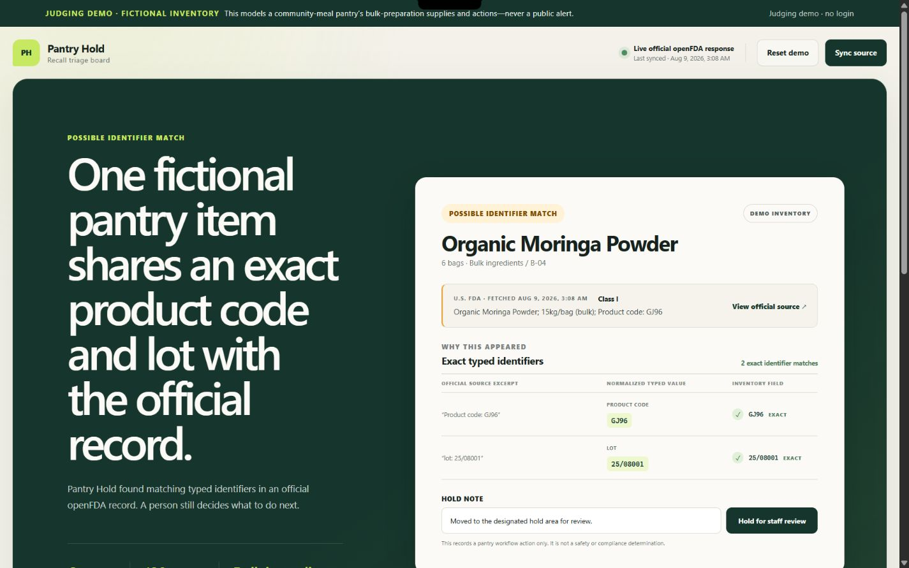
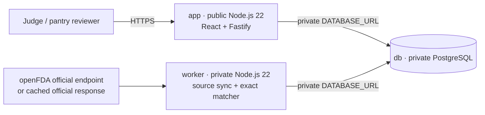
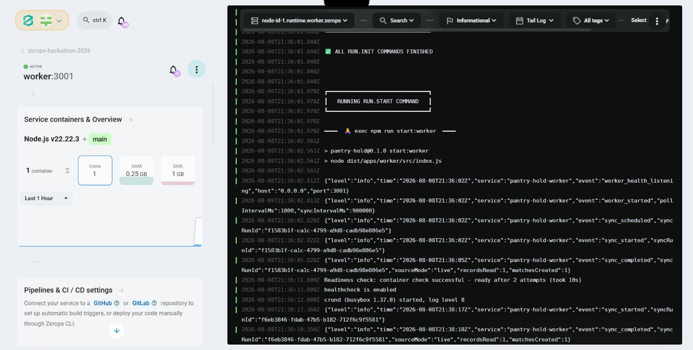

# Pantry Hold

> **One fictional community-meal pantry item shares an exact product code and lot with an official record. Review the evidence, record a hold workflow action, and open the source.**



Pantry Hold is a recall-triage board for a **fictional demo pantry** serving community meals with bulk-preparation supplies. A private worker reads official openFDA food-enforcement data (or the bundled cached copy of an official openFDA response), extracts explicitly labelled identifiers, and compares them with fictional inventory. It reports only deterministic **possible matches** for human review; the demo checks one official record to prove the full pipeline and is not comprehensive recall coverage.

| 3-second value                            | Proof, not prediction                              | Human action                                                        |
| ----------------------------------------- | -------------------------------------------------- | ------------------------------------------------------------------- |
| Find a possible recall-to-inventory match | Show an exact lot AND an exact product code or UPC | Place the inventory record on hold or resolve it with an audit note |

## The problem

Small pantry teams may have inventory labels and an official enforcement record but no quick way to compare the two while preserving the evidence. Product names alone are ambiguous. Pantry Hold narrows the review queue using exact typed identifiers and leaves the decision with a person.

## Demo in under a minute

1. Open the dashboard and notice the persistent **fictional demo data** label.
2. Run/reset the seeded demo; it works without credentials, attempts the live official openFDA record `H-1180-2026`, and uses the labelled cached official response if the endpoint is unavailable.
3. Inspect the single possible match. The evidence shows `product_code:GJ96` and `lot:25/08001` on both records.
4. Compare the second item with the same product name. Its identifiers differ, so it does **not** match.
5. Place the possible match on hold, add a note, then resolve it. The audit timeline preserves both actions.
6. Open the official source URL from the record card.

## Architecture



The UI only renders persisted results. The private worker owns source ingestion, normalization, and exact identifier matching; the browser does not synthesize possible matches.

## Why Zerops is part of the product

- [`app`](https://app-2b48-3000.prg1.zerops.app/) is the only public runtime. It serves the no-login UI/API on port `3000` with readiness and continuous health checks.
- `worker` stays private and performs source sync and matching away from the request path. Its internal port `3001` is used only for `/readyz` and `/healthz` container probes; the import manifest explicitly disables subdomain access.
- `db` is a private, single-container PostgreSQL service. Both runtimes receive `DATABASE_URL` through the Zerops-generated `${db_connectionString}` reference; no credential is committed.
- [`zerops.yaml`](./zerops.yaml) pins both runtimes to Node.js 22 and defines reproducible build/run pipelines. [`zerops-import.yaml`](./zerops-import.yaml) was imported into the existing Lightweight project to provision exactly the reviewed, non-HA three-service topology.
- [The config validator](./scripts/validate-config.mjs) fails if the worker becomes public, the database reference is replaced, checks disappear, or literal secrets are added.



### Deployed resource envelope and observed cost

| Service      | Visibility | Active allocation                                         | 30-day dashboard rate |
| ------------ | ---------- | --------------------------------------------------------- | --------------------: |
| `app`        | Public     | 1 shared CPU, 0.25 GB RAM, 1 GB disk, 1 container         |                 $1.45 |
| `worker`     | Private    | 1 shared CPU, 0.25 GB RAM, 1 GB disk, 1 container         |                 $1.45 |
| `db`         | Private    | PostgreSQL 18 single, 1 shared CPU, 0.5 GB RAM, 1 GB disk |                 $2.20 |
| **Observed** |            | No HA, add-ons, public IPv4, or advanced observability    |   **$5.10 / 30 days** |

The pre-import forecast was `$4.35 / 30 days`; Zerops enforced `0.5 GB` RAM for PostgreSQL rather than the forecast's `0.25 GB`, producing the observed `$5.10 / 30 days` dashboard total. This remains below the existing Z15 promotional balance. A Zerops daily spending limit is an alert, not a hard stop.

## Run locally

Prerequisites: Node.js 22 and npm.

```bash
npm ci
npm run dev
```

The ordinary dev command starts Vite plus one combined local API/worker process. API and real worker share a persistent PGlite database at `.data/pantry-hold`, so the bundled cached-official fallback and fictional inventory make the demo credential-free. The Zerops deployment keeps API and worker in separate services sharing PostgreSQL. Copy [`.env.example`](./.env.example) to `.env` only when local overrides are needed; never commit the populated file.

Quality gates:

```bash
npm run format:check
npm run lint
npm run typecheck
node scripts/validate-config.mjs
node scripts/validate-config.mjs zerops-import.yaml
node scripts/delivery-config.test.mjs
npm test
npm run build
npm audit --omit=dev --audit-level=high
```

## Data and safety boundaries

- Inventory is fictional demo data and must not be represented as a real pantry's stock.
- A possible match requires equality of **exact typed identifiers**: an exact lot AND an exact product code or UPC. The matcher never uses fuzzy product-name matching.
- Product-name similarity never creates a match or hold.
- The source is the official openFDA food-enforcement endpoint or a clearly labelled cached copy of an official openFDA response, stored with source URL, fetch time, and raw hash.
- Pantry Hold does not determine whether food is safe, issue public alerts, certify compliance, or offer consumer advice. It supports internal human review and links back to source evidence.
- openFDA notes that enforcement reports do not contain every recall and should not be used as a recall-lifecycle or public-alert system.

## AI disclosure

OpenAI Codex was used for research, implementation assistance, testing, debugging, and delivery configuration. The author directed the product scope and safety constraints and is responsible for the final decisions and deployment.

## Sources

- [openFDA Food Enforcement API overview](https://open.fda.gov/apis/food/enforcement/)
- [openFDA endpoint usage and limitations](https://open.fda.gov/apis/food/enforcement/how-to-use-the-endpoint/)
- [openFDA searchable fields](https://open.fda.gov/apis/food/enforcement/searchable-fields/)
- [Official cached record query: `H-1180-2026`](https://api.fda.gov/food/enforcement.json?search=recall_number:%22H-1180-2026%22&limit=1)
- [Zerops Node.js build/deploy pipeline](https://docs.zerops.io/nodejs/how-to/build-pipeline)
- [Zerops environment-variable references](https://docs.zerops.io/features/env-variables)
- [Zerops PostgreSQL private connections](https://docs.zerops.io/postgresql/how-to/connect)
- [Zerops pricing](https://docs.zerops.io/company/pricing)
- [The Zerops Challenge rules](https://www.wemakedevs.org/hackathons/zerops/rules)
